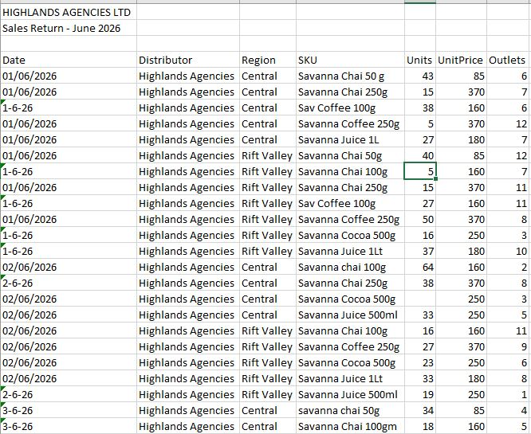
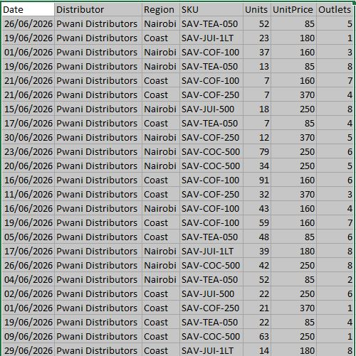
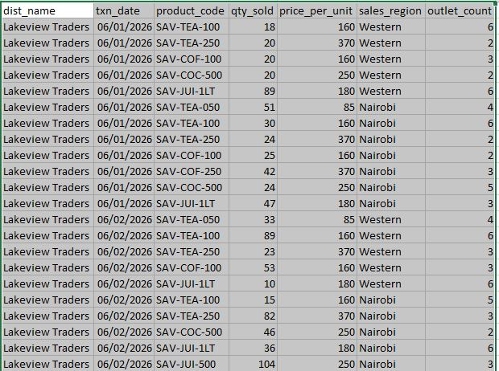
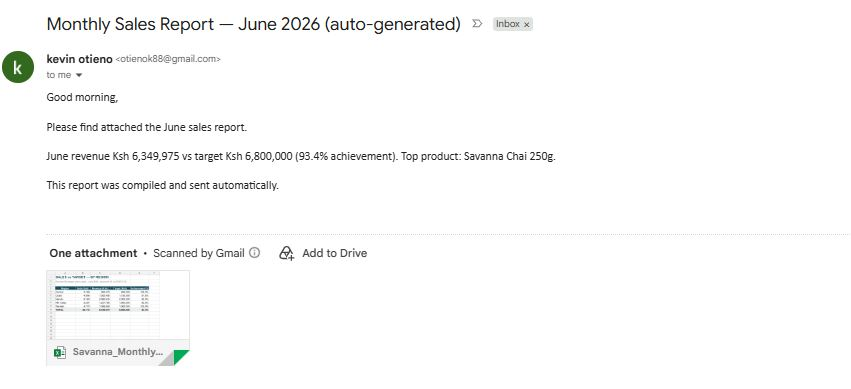

# FMCG Automated Reporting Pipeline (Demo)

**What this is:** a working demonstration of the reporting automation I build for
businesses — using entirely fictional data for a made-up beverage company,
"Savanna Beverages". No real company data appears anywhere in this project.

**The problem it solves:** every month, sales data arrives from multiple
distributors in different formats — different column names, mixed date formats,
typo'd product names, duplicate rows, junk header rows. Someone spends hours
cleaning and consolidating it in Excel before management can see a single number.

## The mess that comes in

Three distributors, three formats, three different kinds of broken:

**Highlands Agencies** — human-maintained Excel: junk header rows, mixed date
formats in the same column (`01/06/2026` next to `1-6-26`), typo'd product names
(`Sav Coffee 100g`, `savanna chai 50g`), missing values, a stray TOTAL row:



**Pwani Distributors** — CSV with duplicate rows and zero-unit junk entries:



**Lakeview Traders** — system export with completely different column names
and order (`txn_date`, `product_code`, `qty_sold`...):



## What one run of the pipeline does (seconds, not hours)

1. **Collect** — reads all three files, whatever their format
2. **Clean** — removes duplicates, skips junk headers, standardises mixed date
   formats, maps typo'd product names to a canonical catalogue, flags missing data
3. **Report** — builds a formatted Excel workbook:
   - Sales vs Target by region (with achievement %)
   - Product performance ranking
   - Distributor summary
   - **Data Quality Log** — every issue caught and fixed, as an audit trail
4. **Deliver** — emails the report through Outlook on a schedule
   (Windows Task Scheduler), so it arrives before anyone is at their desk:



## Run it yourself

```
pip install pandas openpyxl
python generate_data.py   # creates the messy raw files in /raw
python pipeline.py        # cleans, consolidates, writes /output report
```

To enable the email step on Windows: `pip install pywin32`, set
`SEND_EMAIL = True` and a recipient in `pipeline.py`, and schedule
`pipeline.py` with Task Scheduler.

## Stack

Python (pandas, openpyxl) · SQL Server in production versions ·
Windows Task Scheduler · Outlook (win32com) · Power BI for dashboards

---
*Kevin Otieno — [kevinoti.github.io/portfolio](https://kevinoti.github.io/portfolio/) · otienok88@gmail.com*
